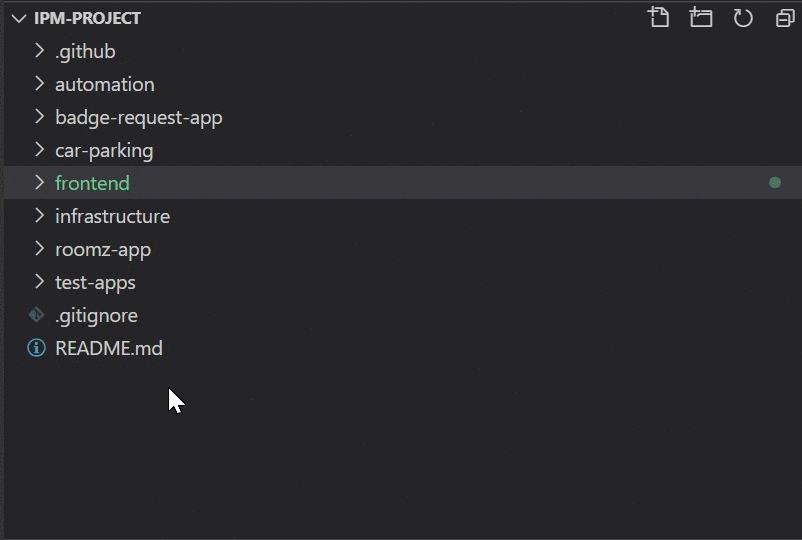

<h1 align="center">
  <br>
  
  <br>
  Reception
  <br>
</h1> 

<p align="center">
  <a href="#">
    
  </a>
</p>

<p align="center">
  • <a href="#how-to-use">How To Use</a> •
  <a href="#built-with">Built With</a> •
  <a href="#use-case">Use Case</a> •
  <a href="#file-structure">File Stucture</a> •

</p>


## Use Case
> User Application where all teams ZoomZ && AppZilla && ChaosLegion could work together to be able to Create a User UI of the Application. Download all tools which is required and stick to the file structure in order to start development. You can find related instruction to each section down below. 


## Built With
 <h2>React  <a href="https://opencollective.com/choo/sponsor/0/website" target="_blank"></a> </h2>
 <hr>
 <h2>Spring Boot <a href="https://opencollective.com/choo/sponsor/0/website" target="_blank"></a> </h2>
<hr>

 ## Tools 
 - npm 
 - maven 
 - Docker
 - Visual Studio Code
 - IntelJS
 - NVM 
 - Git 


## File Stucture
 


## How To Use

To clone and run this application, you'll need [Git](https://git-scm.com) and [Docker](https://docs.docker.com/engine/install/) installed on your computer. From your command line:

```bash
# Clone this repository
$ git clone https://github.com/internshipseason2020/ipm-project.git

# Go into the repository
$ cd ipm-project/frontend

# Run using Docker
$ docker-compose up

```


## Authors

👤 **Bekhzod Akhrorov**

- Github:[@Bekhzod96](https://github.com/Bekhzod96)
- Twitter: [@Begzod](https://twitter.com/25d47e8987f740b)
- Linkedin:[@Bekhzod AKhrorov](https://www.linkedin.com/in/bekhzod-akhrorov/)


