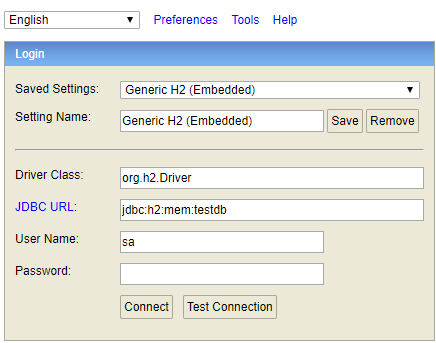
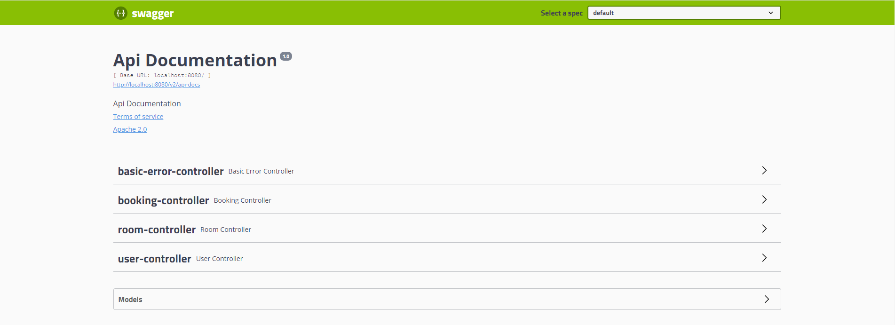

<h1 align="center">Welcome to RoomZ microservice Backend 👋</h1>

  

> This project allows you to easy book rooms (in theory)

## Dependencies

  
  

  
-Build tool

 

  
-Database schema migration

 

  
-Production database

 

  
-Development testing database

 

  
-Development testing tool for API calls

 

  
-Centralized logging tool

  
-Local logging tool

## How to launch project locally

 
Select main method in the dropdown box and press Run. It will run project with DEVELOPMENT profile.

## How to access H2Console

Once the project runs, you can access h2-console on your local machine.  
[H2-console](http://localhost:8080/h2-console) http://localhost:8080/h2-console

Make sure Driver Class and JDBC URL matches from image.

User Name: sa  
Password: password

## How to access swagger-ui

Once project runs, you can access swagger-ui on your local machine to test API calls.  
[Swagger-ui](http://localhost:8080/swagger-ui) http://localhost:8080/swagger-ui

## Author

👤 **Peteris, Everita**

* Github: [@PeterisZevaldsCog](https://github.com/PeterisZevaldsCog)
* Github: [@Spelmane](https://github.com/Spelmane)

***
_This README was generated with ❤️ by [readme-md-generator](https://github.com/kefranabg/readme-md-generator)_
